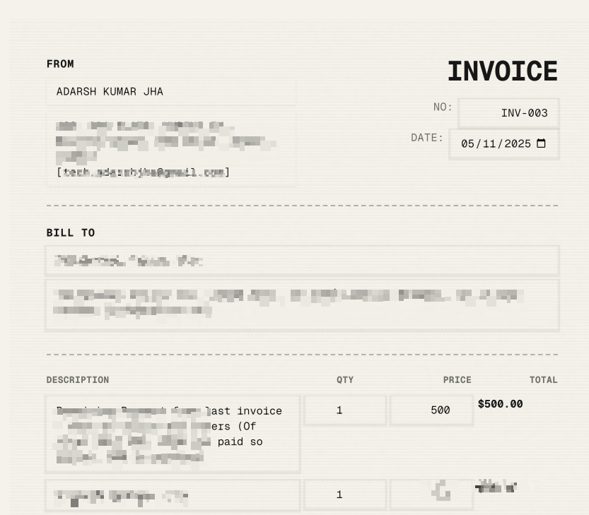

# Invoice Creator



A simple web app that creates beautiful, vintage-style invoices with an authentic paper texture—like the ones from old receipt printers.

## What it does

Makes invoicing easy and elegant. Fill in your details, add line items, and get a print-ready invoice that looks like it came from another era. Perfect for freelancers, small businesses, or anyone who wants their invoices to stand out.

## Features

- **Antique paper aesthetic** — Choose from cream, mint, peach, blue, or white paper colors with authentic texture
- **Receipt printer styling** — Dotted separators and monospace fonts for that vintage feel
- **Print-ready** — Save as PDF or print directly—everything looks perfect on paper
- **Auto-save** — Your work is saved automatically as you type
- **No sign-up needed** — Everything runs in your browser, no accounts or servers
- **Add your signature** — Upload an image of your signature for a professional touch

## How to use

1. **From section** — Enter your business name and address
2. **Bill To section** — Add your client's details
3. **Line items** — Add products or services with quantities and prices
4. **Customize** — Pick a paper color and upload your signature (optional)
5. **Print or save** — Click the button to download as PDF or print

Your invoice is automatically saved to your browser, so you can come back and edit it anytime.

## Getting started

```bash
# Install dependencies
pnpm install

# Run the development server
pnpm dev
```

Open [http://localhost:3000](http://localhost:3000) to start creating invoices.

## Built with

- [Next.js](https://nextjs.org/) — React framework
- [TypeScript](https://www.typescriptlang.org/) — Type safety
- [Tailwind CSS](https://tailwindcss.com/) — Styling
- [shadcn/ui](https://ui.shadcn.com/) — UI components

## Deploy

Deploy instantly on [Vercel](https://vercel.com):

[](https://vercel.com/new/clone?repository-url=https://github.com/tech-adarshjha/Invoice-Creator)

## License

MIT — feel free to use this for personal or commercial projects.

---

Made by [Adarsh Jha](https://adarshjha.com)

